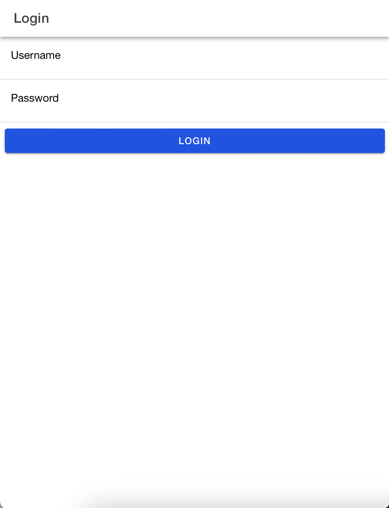
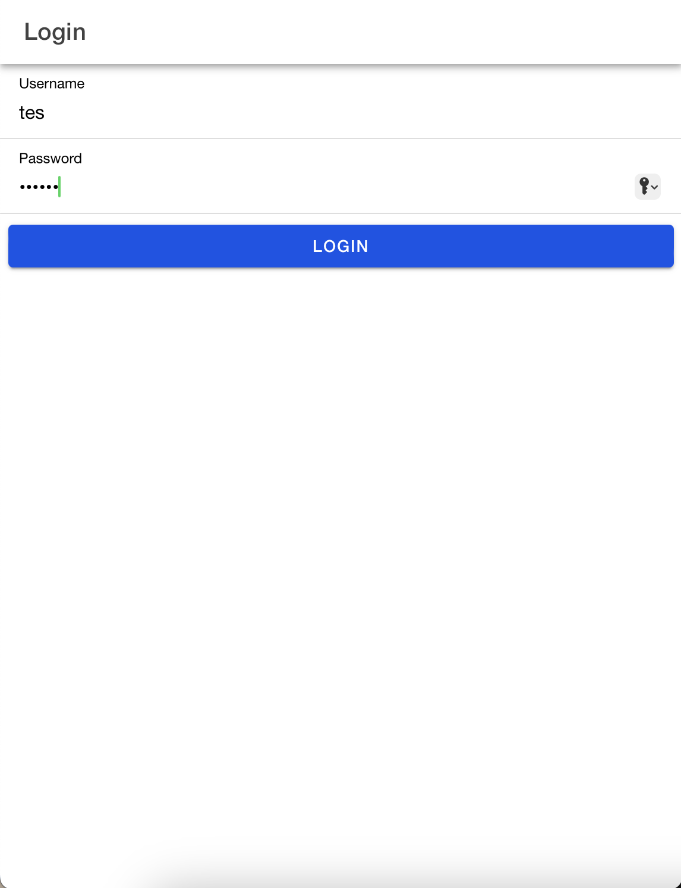
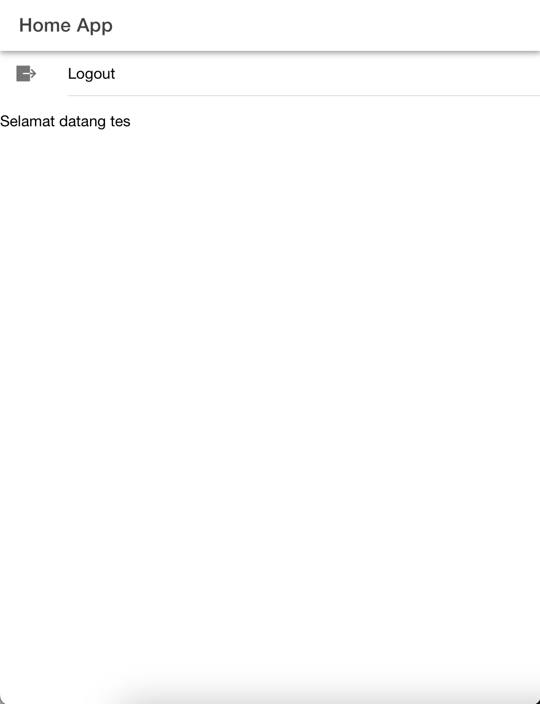

# Tugas Pertemuan 8

## 1. Halaman Form Login
Halaman ini menampilkan form login yang untuk mengisikan username dan password

## 2. Mengisi login dengan username dan password yang sesuai
Berikut adalah pengisian username dan password yang sesuai dengan database, yaitu
username : tes
password : tes123

## 3. Halaman Home
Ketika sudah berhasil untuk melakukan login, maka selanjutnya akan diarahkan menuju halaman home app yang berisi pesan selamat datang dan icon untuk melakukan logout

